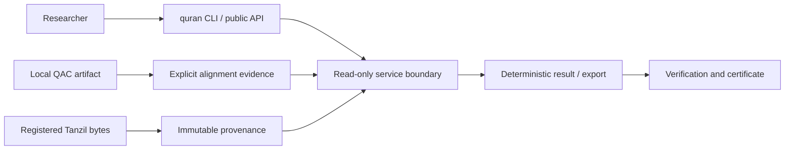

# lifecycle

```mermaid
flowchart LR
  Researcher[Researcher] --> CLI[quran CLI / public API]
  CLI --> ReadOnly[Read-only service boundary]
  Raw[Registered Tanzil bytes] --> Provenance[Immutable provenance]
  QAC[Local QAC artifact] --> Alignment[Explicit alignment evidence]
  Alignment --> ReadOnly
  Provenance --> ReadOnly
  ReadOnly --> Result[Deterministic result / export]
  Result --> Verify[Verification and certificate]
```
